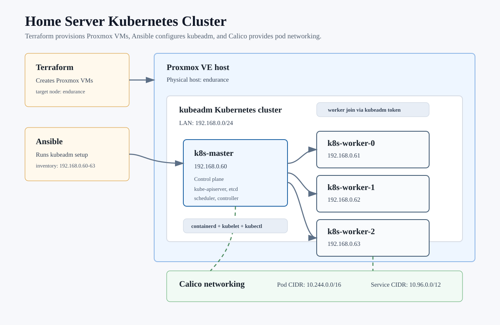

# Home Server Kubernetes Homelab

This repository contains the current infrastructure for a Proxmox-backed
kubeadm Kubernetes cluster, plus the first cluster services deployed on top of
it.

The current deployment flow is intentionally staged:

1. Terraform creates the Proxmox VMs.
2. Ansible bootstraps Kubernetes with kubeadm and Calico.
3. Terraform installs MetalLB and its custom resources.
4. Helm deploys applications such as Homepage and Grafana.



## Current Topology

The cluster runs on Proxmox node `endurance`.

| Role | Name | IP | Resources |
| --- | --- | --- | --- |
| Control plane | `k8s-master` | `192.168.0.60` | 3 CPU cores, 6 GiB RAM, 50 GiB disk |
| Worker | `k8s-worker-0` | `192.168.0.61` | 2 CPU cores, 4 GiB RAM, 50 GiB disk |
| Worker | `k8s-worker-1` | `192.168.0.62` | 2 CPU cores, 4 GiB RAM, 50 GiB disk |
| Worker | `k8s-worker-2` | `192.168.0.63` | 2 CPU cores, 4 GiB RAM, 50 GiB disk |

Cluster networking:

- Pod CIDR: `10.244.0.0/16`
- Service CIDR: `10.96.0.0/12`
- CNI: Calico
- LoadBalancer implementation: MetalLB in L2 mode
- LoadBalancer IPs: `192.168.0.200`, `192.168.0.201`

## Repository Layout

```text
terraform/
  nodes/                  Proxmox VM provisioning
  infra/metallb/          MetalLB Helm release and CRDs
  infra/metallb-config/   MetalLB IPAddressPool and L2Advertisement

ansible/
  k8s_setup.yml           kubeadm cluster bootstrap
  get_kubeconfig.yml      fetches admin kubeconfig from the master
  artifacts/kubeconfig    local kubeconfig, ignored by git

k8s/
  homepage/               local Helm chart for Homepage
  grafana/                values file for Grafana Helm chart
```

## 1. Deploy Nodes

Create `terraform/nodes/terraform.tfvars` from the example file:

```sh
cd terraform/nodes
cp terraform.tfvars.example terraform.tfvars
```

Fill in the Proxmox token and SSH key, then apply:

```sh
terraform init
terraform apply
```

Secrets such as `terraform.tfvars`, Terraform state, Ansible artifacts, and
kubeconfig files are ignored by git.

## 2. Bootstrap Kubernetes

From the Ansible directory:

```sh
cd ansible
ansible-playbook k8s_setup.yml
```

The playbook:

- prepares Debian nodes for Kubernetes
- disables swap
- installs containerd, kubeadm, kubelet, and kubectl
- initializes the control plane
- installs Calico through the Tigera operator
- joins the worker nodes

Fetch the admin kubeconfig:

```sh
ansible-playbook get_kubeconfig.yml
```

The kubeconfig is written to:

```text
ansible/artifacts/kubeconfig
```

Use it locally with:

```sh
export KUBECONFIG=/Users/josejsanchez/git/home-server/ansible/artifacts/kubeconfig
```

## 3. Deploy MetalLB

MetalLB is split into two Terraform roots because the official Kubernetes
provider must see CRDs before it can plan custom resources.

Install MetalLB and its CRDs:

```sh
cd terraform/infra/metallb
terraform init
terraform apply
```

Apply the MetalLB configuration:

```sh
cd ../metallb-config
terraform init
terraform apply
```

Current MetalLB settings:

- IP pool: `192.168.0.200`, `192.168.0.201`
- L2 advertisement enabled
- `speaker.tolerateMaster = false`
- `speaker.frr.enabled = false`

This keeps MetalLB speakers off the control-plane node and avoids FRR/BGP
sidecars because the cluster uses L2 mode.

## 4. Deploy Homepage

Homepage is packaged as a local Helm chart.

```sh
helm upgrade --install homepage ./k8s/homepage \
  --namespace homepage \
  --create-namespace
```

Current exposure:

```text
http://192.168.0.201
```

Its config is provided from a ConfigMap and copied into a writable runtime
directory before startup.

## 5. Deploy Grafana

Grafana uses the `grafana-community/grafana` Helm chart with values from this
repo:

```sh
helm repo add grafana-community https://grafana-community.github.io/helm-charts
helm upgrade --install grafana grafana-community/grafana \
  --namespace grafana \
  --create-namespace \
  --values k8s/grafana/values.yaml
```

Current exposure:

```text
http://192.168.0.200
```

Get the admin password:

```sh
kubectl get secret --namespace grafana grafana \
  -o jsonpath="{.data.admin-password}" | base64 --decode; echo
```

Important current limitation: Grafana persistence is disabled. It uses
`emptyDir`, so UI-created dashboards and settings can be lost when the pod is
recreated.

Grafana also has no metrics datasource yet. Grafana is the UI/query layer; it
does not collect Kubernetes metrics by itself.

## Current Services

| Service | Namespace | IP | Port | Notes |
| --- | --- | --- | --- | --- |
| Grafana | `grafana` | `192.168.0.200` | `80` | No datasource or persistence yet |
| Homepage | `homepage` | `192.168.0.201` | `80` | Local Helm chart |

Check services:

```sh
kubectl get svc -A
```

Check pods:

```sh
kubectl get pods -A -o wide
```

## Monitoring Next Step

The next infrastructure step is adding a metrics backend for Grafana.

For the smallest useful setup, add Prometheus and configure it as a Grafana
datasource.

For the full Kubernetes monitoring stack, use `kube-prometheus-stack`, which
adds Prometheus, Alertmanager, exporters, dashboards, and CRDs such as
`ServiceMonitor`, `PodMonitor`, and `PrometheusRule`.

Because this homelab is sensitive to pod count, plain Prometheus is likely the
better first step.


## TODO
  - Add a Kubernetes StorageClass.
  - Use local-path-provisioner unless choosing a more advanced storage option.
  - Enable Grafana persistence.
  - Set Grafana storage to something like:

    persistence:
      enabled: true
      storageClassName: local-path
      size: 5Gi
      accessModes:
        - ReadWriteOnce

  - Add a metrics backend for Grafana.
  - Start with plain Prometheus if keeping pod count low.
  - Configure Grafana datasource to point to Prometheus.
  - Decide later whether to replace plain Prometheus with kube-prometheus-stack.
  - Update README2.md after storage and monitoring are wired in.